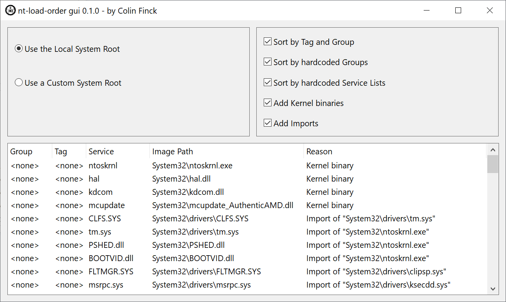

# nt-load-order Rust crate

[](https://crates.io/crates/nt-load-order)
[](https://docs.rs/nt-load-order)


*by Colin Finck <<colin@reactos.org>>*

A library along with a Win32 GUI application to determine the driver load order of a Windows system.

nt-load-order can be used to analyze either the current operating system or any target system root directory.
The latter step even works on non-Windows platforms (leveraging my platform-independent [nt-hive](https://crates.io/crates/nt-hive) crate).

This project is closely related to my two-part blog series on WinDbg fundamentals, the Windows driver load order, and the nt-load-order crate:

* [Part 1: WinDbg'ing our way into the Windows bootloader](https://colinfinck.de/posts/nt-load-order-part-1/)
* [Part 2: More than you ever wanted to know](https://colinfinck.de/posts/nt-load-order-part-2/)

## nt-load-order-gui


nt-load-order-gui is the Win32 GUI example application to demonstrate all features of the nt-load-order library.

You can freely turn on and off any step in the creation of the boot driver load order and find out why a certain driver got its position in the list.

nt-load-order-gui can be obtained via:

```
cargo install nt-load-order-gui
```

## License
This crate is licensed under either of

 * [Apache License, Version 2.0](http://www.apache.org/licenses/LICENSE-2.0)
 * [MIT license](http://opensource.org/licenses/MIT)

at your option.

Unless you explicitly state otherwise, any contribution intentionally submitted for inclusion in the work by you, as defined in the Apache-2.0 license, shall be dual licensed as above, without any additional terms or conditions.
